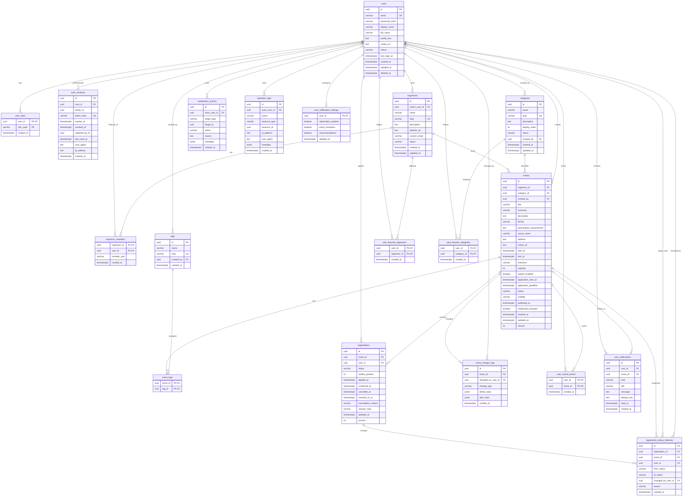

# ER図

```mermaid
erDiagram
  %% Line notation:
  %% || = exactly one
  %% o| = zero or one
  %% o{ = zero or many
  %% A ||--o{ B = one A can have zero or many B; each B belongs to exactly one A
  %% A o|--o{ B = optional A can have zero or many B; each B may have zero or one A

  users ||--o{ user_roles : has
  users ||--o{ auth_sessions : authenticates
  users ||--o{ organizers : owns
  users ||--o{ organizer_members : belongs_to
  organizers ||--o{ organizer_members : has
  users o|--o{ categories : created_by
  users o|--o{ tags : created_by
  organizers ||--o{ events : hosts
  categories ||--o{ events : classifies
  users ||--o{ events : creates
  events ||--o{ event_tags : has
  tags ||--o{ event_tags : assigned
  users ||--o{ registrations : applies
  events ||--o{ registrations : receives
  registrations ||--o{ registration_status_histories : changes
  events ||--o{ registration_status_histories : snapshots
  users ||--o{ registration_status_histories : target_user
  users o|--o{ registration_status_histories : changed_by
  users ||--o{ user_favorite_organizers : follows
  organizers ||--o{ user_favorite_organizers : followed
  users ||--o{ user_favorite_categories : follows
  categories ||--o{ user_favorite_categories : followed
  events ||--o{ event_change_logs : changed
  users ||--o{ event_change_logs : changed_by
  users ||--o{ moderation_actions : actor
  users o|--o{ operation_logs : actor
  users ||--o{ user_saved_events : saves
  events ||--o{ user_saved_events : saved
  users ||--o| user_notification_settings : configures
  users ||--o{ user_notifications : receives
  events o|--o{ user_notifications : relates_to

  users {
    uuid id PK
    varchar email UK
    varchar password_hash
    varchar display_name
    varchar full_name
    text profile_text
    text avatar_url
    varchar status
    timestamptz last_login_at
    timestamptz created_at
    timestamptz updated_at
    timestamptz deleted_at
  }

  user_roles {
    uuid user_id PK,FK
    varchar role_code PK
    timestamptz created_at
  }

  organizers {
    uuid id PK
    uuid owner_user_id FK
    varchar name
    varchar slug UK
    text description
    text website_url
    varchar contact_email
    varchar status
    timestamptz created_at
    timestamptz updated_at
  }

  organizer_members {
    uuid organizer_id PK,FK
    uuid user_id PK,FK
    varchar member_role
    timestamptz created_at
  }

  categories {
    uuid id PK
    varchar name
    varchar slug UK
    text description
    int display_order
    varchar status
    uuid created_by FK
    timestamptz created_at
    timestamptz updated_at
  }

  tags {
    uuid id PK
    varchar name
    varchar slug UK
    uuid created_by FK
    timestamptz created_at
  }

  events {
    uuid id PK
    uuid organizer_id FK
    uuid category_id FK
    uuid created_by FK
    varchar title
    varchar summary
    text description
    varchar format
    text participation_requirements
    varchar venue_name
    text address
    text online_url
    timestamptz start_at
    timestamptz end_at
    varchar timezone
    int capacity
    boolean waitlist_enabled
    timestamptz application_start_at
    timestamptz application_deadline
    varchar status
    varchar visibility
    timestamptz published_at
    boolean moderation_blocked
    timestamptz created_at
    timestamptz updated_at
    int version
  }

  event_tags {
    uuid event_id PK,FK
    uuid tag_id PK,FK
  }

  registrations {
    uuid id PK
    uuid event_id FK
    uuid user_id FK
    varchar status
    int waitlist_position
    timestamptz applied_at
    timestamptz confirmed_at
    timestamptz cancelled_at
    timestamptz checked_in_at
    varchar cancellation_reason
    varchar checkin_note
    timestamptz updated_at
    int version
  }

  registration_status_histories {
    uuid id PK
    uuid registration_id FK
    uuid event_id FK
    uuid user_id FK
    varchar from_status
    varchar to_status
    uuid changed_by_user_id FK
    varchar reason
    timestamptz created_at
  }

  user_favorite_organizers {
    uuid user_id PK,FK
    uuid organizer_id PK,FK
    timestamptz created_at
  }

  user_favorite_categories {
    uuid user_id PK,FK
    uuid category_id PK,FK
    timestamptz created_at
  }

  event_change_logs {
    uuid id PK
    uuid event_id FK
    uuid changed_by_user_id FK
    varchar change_type
    jsonb before_data
    jsonb after_data
    timestamptz created_at
  }

  moderation_actions {
    uuid id PK
    uuid actor_user_id FK
    varchar target_type
    uuid target_id
    varchar action
    text reason
    jsonb metadata
    timestamptz created_at
  }

  operation_logs {
    uuid id PK
    uuid actor_user_id FK
    varchar action
    varchar resource_type
    uuid resource_id
    inet ip_address
    text user_agent
    jsonb metadata
    timestamptz created_at
  }

  auth_sessions {
    uuid id PK
    uuid user_id FK
    uuid family_id
    varchar token_hash UK
    timestamptz expires_at
    timestamptz revoked_at
    uuid replaced_by_id
    timestamptz last_used_at
    text user_agent
    inet ip_address
    timestamptz created_at
  }

  user_saved_events {
    uuid user_id PK,FK
    uuid event_id PK,FK
    timestamptz created_at
  }

  user_notification_settings {
    uuid user_id PK,FK
    boolean registration_updates
    boolean event_reminders
    boolean recommendations
    timestamptz updated_at
  }

  user_notifications {
    uuid id PK
    uuid user_id FK
    uuid event_id FK
    varchar kind
    varchar title
    text message
    text dedupe_key
    timestamptz read_at
    timestamptz created_at
  }

```
